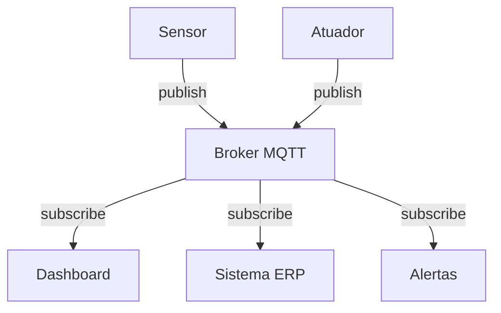
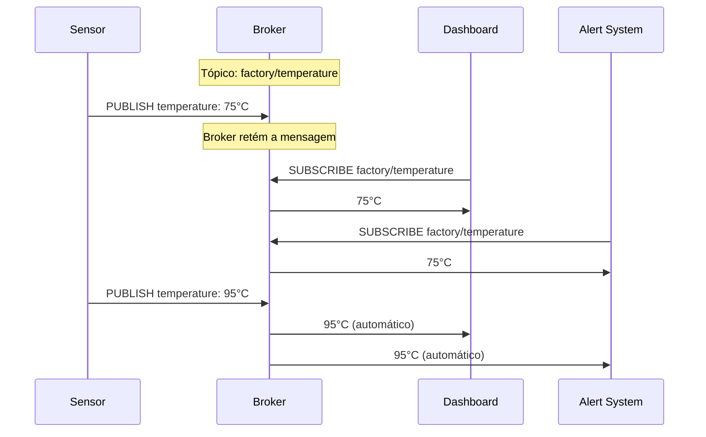

# 📡 Fundamentos MQTT

Message Queuing Telemetry Transport

---
layout: default
---

# 🤔 O que é MQTT?

## Definição
**MQTT** (Message Queuing Telemetry Transport) é um protocolo de mensagens leve, projetado para comunicação M2M (Machine-to-Machine) em redes com largura de banda limitada.

## Características
- **Leve**: Overhead mínimo
- **Confiável**: Diferentes níveis de QoS
- **Bidirecional**: Publish/Subscribe
- **Persistente**: Mensagens retidas
- **Seguro**: Suporte TLS/SSL

---
layout: two-cols
---

# 🆚 MQTT vs Outros Protocolos

## Por que MQTT na Indústria?

<v-clicks>

### ✅ **Vantagens do MQTT:**
- Baixo consumo de energia
- Funciona com conexões instáveis
- Suporte nativo ao IoT
- Escalabilidade horizontal
- Padrão aberto (ISO/IEC 20922)

### ⚡ **Comparação:**
- **HTTP**: Muito pesado para IoT
- **CoAP**: Bom, mas menos maduro
- **WebSocket**: Ótimo para web, complexo para embarcados
- **AMQP**: Robusto, mas pesado

</v-clicks>

::right::

| Protocolo | Overhead | Tempo Real | IoT Ready |
|-----------|----------|------------|-----------|
| **MQTT**  | 2 bytes  | ✅ Sim     | ✅ Sim    |
| HTTP      | ~200 bytes | ❌ Não    | ⚠️ Limitado |
| CoAP      | 4 bytes  | ✅ Sim     | ✅ Sim    |
| WebSocket | 6+ bytes | ✅ Sim     | ⚠️ Limitado |

💡 MQTT é 100x mais eficiente que HTTP

---
layout: default
---

# 🏗️ Modelo Publish/Subscribe

<strong>Publisher</strong> 
Envia dados para tópicos

<strong>Broker</strong> 
Gerencia e roteia mensagens

<strong>Subscriber</strong> 
Recebe dados de tópicos

