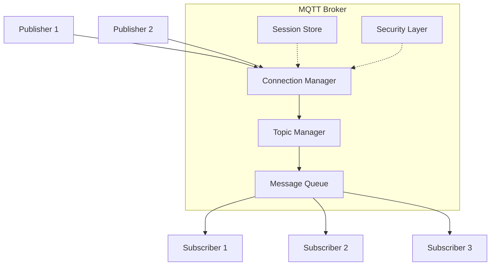

# 🏗️ Arquitetura e Componentes

Broker, QoS, e Segurança

---
layout: default
---

# 🎛️ MQTT Broker

## O Coração do Sistema MQTT

<div class="grid grid-cols-2 gap-8 mt-6">

<div>

### 🔧 Responsabilidades
- **Receber** mensagens dos publishers
- **Filtrar** mensagens por tópico
- **Distribuir** para subscribers
- **Autenticar** clientes
- **Gerenciar** sessões persistentes
- **Aplicar** regras de QoS

### 🏭 Brokers Populares
- **Mosquitto** - Open source, leve
- **HiveMQ** - Enterprise, alta performance
- **AWS IoT Core** - Cloud, escalável
- **Azure IoT Hub** - Microsoft cloud
- **EMQX** - Distribuído, clusters

</div>

<div>



</div>

</div>

---
layout: default
---

# 🎚️ Quality of Service (QoS)

## Garantias de Entrega

<div class="grid grid-cols-3 gap-6 mt-8">

<div class="p-4 border-2 border-green-300 rounded-lg">

### **QoS 0** - At most once
<div class="text-sm opacity-80 mb-3">🚀 Fire and Forget</div>

- **Entrega**: No máximo 1 vez
- **Garantia**: Nenhuma
- **Uso**: Dados não críticos
- **Exemplo**: Leituras frequentes de sensores

```
Publisher → Broker → Subscriber
    (sem confirmação)
```

</div>

<div class="p-4 border-2 border-yellow-300 rounded-lg">

### **QoS 1** - At least once
<div class="text-sm opacity-80 mb-3">✅ Acknowledged Delivery</div>

- **Entrega**: Pelo menos 1 vez
- **Garantia**: PUBACK
- **Uso**: Dados importantes
- **Exemplo**: Alarmes, comandos

```
Publisher → Broker → Subscriber
    ↙      PUBACK     ↙
```

</div>

<div class="p-4 border-2 border-red-300 rounded-lg">

### **QoS 2** - Exactly once
<div class="text-sm opacity-80 mb-3">🎯 Assured Delivery</div>

- **Entrega**: Exatamente 1 vez
- **Garantia**: PUBREC/PUBREL/PUBCOMP
- **Uso**: Dados críticos
- **Exemplo**: Transações financeiras

```
Publisher ↔ Broker ↔ Subscriber
    (handshake de 4 etapas)
```

</div>

</div>

---
layout: two-cols
---

# 🔒 Segurança MQTT

## Camadas de Proteção

<v-clicks>

### 🌐 **Nível de Transporte**
- **TLS/SSL**: Criptografia ponto-a-ponto
- **Certificados**: Autenticação mutual
- **Portas seguras**: 8883 (MQTTS)

### 🔐 **Nível de Aplicação**
- **Username/Password**: Autenticação básica
- **Client ID**: Identificação única
- **Access Control Lists**: Controle de tópicos

### 🛡️ **Nível de Rede**
- **VPN**: Túneis seguros
- **Firewall**: Filtragem de tráfego
- **Network Segmentation**: Isolamento

</v-clicks>

::right::

<div class="mt-4">

### 🏭 **Configuração Industrial**

```yaml
# mosquitto.conf
listener 8883
cafile ca.crt
certfile server.crt
keyfile server.key

# Autenticação
allow_anonymous false
password_file /etc/mosquitto/passwd

# ACLs por tópico
acl_file /etc/mosquitto/acls

# Log de segurança
log_type all
log_dest file /var/log/mosquitto.log
```

<div class="mt-4 p-3 bg-red-50 rounded text-sm">
⚠️ <strong>Nunca</strong> use MQTT sem segurança em produção!
</div>

</div>

---
layout: default
---

# 📊 Sessões Persistentes

## Garantindo Continuidade

<div class="grid grid-cols-2 gap-8 mt-6">

<div>

### 🔄 **Clean Session = false**
```cpp
// ESP32 - Sessão persistente
client.setCleanSession(false);
client.setClientId("factory_sensor_001");

// Broker lembra:
// - Subscriptions ativas
// - Mensagens QoS 1/2 pendentes
// - Estado da conexão
```

### ✨ **Vantagens**
- Mensagens não se perdem
- Reconexão automática
- Estado preservado
- Ideal para sensores críticos

</div>

<div>

### 🆕 **Clean Session = true**
```cpp
// ESP32 - Sessão limpa
client.setCleanSession(true);

// A cada conexão:
// - Nova sessão
// - Sem histórico
// - Subscriptions devem ser refeitas
```

### ⚡ **Vantagens**
- Menor uso de memória no broker
- Conexões mais rápidas
- Ideal para dados temporários

</div>

</div>

<div class="mt-8 p-4 bg-blue-50 rounded-lg">
<strong>💡 Dica Industrial:</strong> Use sessões persistentes para sensores críticos e sessões limpas para monitoramento geral.
</div>
