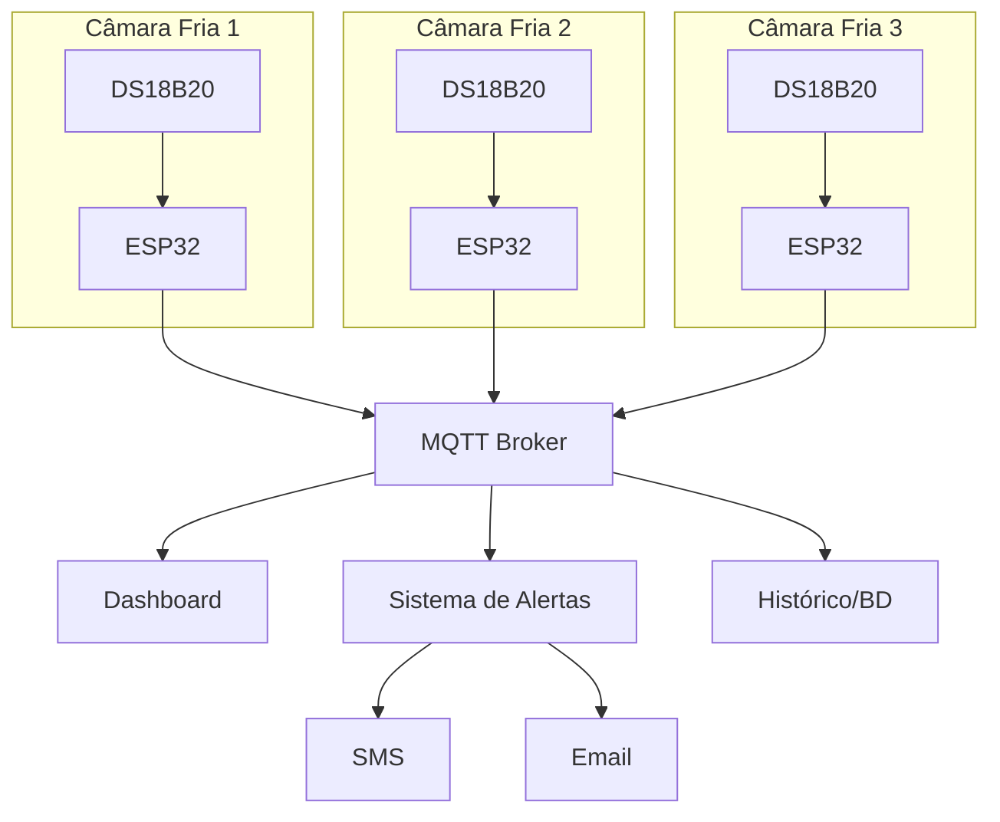
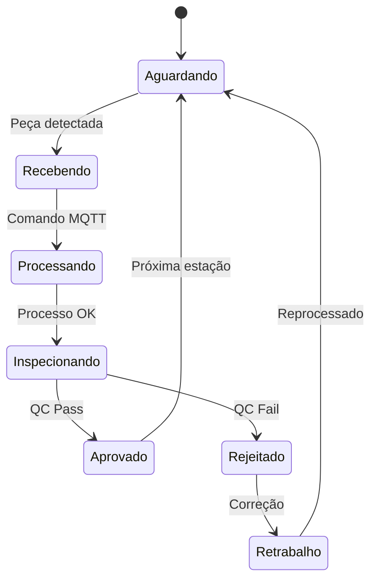

# 🏭 Casos de Uso Industrial

MQTT na prática industrial

---
layout: default
---

# 🌡️ Monitoramento de Temperatura

## Sistema de Controle Térmico

<div class="grid grid-cols-2 gap-8 mt-6">

<div>

### 🎯 **Cenário**
Fábrica de alimentos precisa monitorar temperatura de câmaras frigoríficas em tempo real com alertas automáticos.

### 📊 **Requisitos**
- Leitura a cada 30 segundos
- Alerta se T > 5°C ou T < -20°C
- Histórico para auditoria
- Dashboard em tempo real
- Notificação SMS/Email

### 🔧 **Implementação**
- Sensores DS18B20 em cada câmara
- ESP32 como gateway local
- Broker MQTT centralizado
- Node-RED para regras de negócio

</div>

<div>



</div>

</div>

### 📝 **Estrutura de Tópicos**
```
frigorifico/
├── camara1/temperatura
├── camara1/status
├── camara2/temperatura
├── camara2/status
├── alertas/temperatura
└── config/setpoints
```

---
layout: default
---

# ⚡ Monitoramento de Energia

## Smart Grid Industrial

<div class="grid grid-cols-2 gap-6 mt-6">

<div>

### 🏭 **Desafio Industrial**
Metalúrgica precisa:
- Monitorar consumo por setor
- Detectar picos de demanda
- Otimizar distribuição de cargas
- Reduzir custos energéticos

### 🔌 **Sensores Utilizados**
- Medidores de energia trifásicos
- Transformadores de corrente (TC)
- Medidores de fator de potência
- Sensores de qualidade de energia

</div>

<div>

### 📊 **Dados Coletados**
```json
{
  "setor": "fundição",
  "consumo_kw": 150.5,
  "corrente_a": 245.8,
  "tensao_v": 380,
  "fator_potencia": 0.89,
  "thd_i": 12.5,
  "timestamp": "2025-08-25T14:30:00Z"
}
```

### ⚠️ **Alertas Configurados**
- Consumo > 200kW
- Fator de potência < 0.85
- THD > 15%
- Queda de tensão > 5%

</div>

</div>

<div class="mt-6">

### 🎚️ **Hierarquia de Tópicos**
```
energia/
├── setor_fundição/
│   ├── consumo_kw
│   ├── demanda_maxima
│   └── fator_potencia
├── setor_usinagem/
│   ├── consumo_kw
│   └── maquinas/torno_01/status
├── alertas/
│   ├── sobrecarga
│   └── qualidade_energia
└── tarifacao/
    ├── ponta
    └── fora_ponta
```

</div>

---
layout: default
---

# 🤖 Controle de Máquinas

## Automação Distribuída

<div class="grid grid-cols-2 gap-8 mt-6">

<div>

### 🏗️ **Sistema de Produção**
Linha de montagem automotiva com:
- 12 estações de trabalho
- Robôs colaborativos
- Controle de qualidade automatizado
- Rastreamento de produtos

### 📡 **Comunicação MQTT**
```cpp
// Comando para robô
Topic: "linha1/robo_01/comando"
Payload: {
  "acao": "pegar_peca",
  "posicao": {"x": 150, "y": 200, "z": 50},
  "velocidade": 80
}

// Status do robô
Topic: "linha1/robo_01/status"
Payload: {
  "estado": "ocupado",
  "posicao_atual": {"x": 148, "y": 198, "z": 52},
  "peca_id": "ABC123456"
}
```

</div>

<div>

### 🔄 **Fluxo de Produção**



### 📊 **KPIs Monitorados**
- Tempo de ciclo por estação
- Taxa de defeitos (%)
- OEE (Overall Equipment Effectiveness)
- Throughput por hora

</div>

</div>

---
layout: default
---

# 📱 Rastreamento de Ativos

## Asset Tracking com MQTT

<div class="grid grid-cols-2 gap-8 mt-6">

<div>

### 🚛 **Logística Industrial**
Sistema para rastrear:
- Empilhadeiras e equipamentos móveis
- Containers e pallets
- Ferramentas e instrumentos
- Pessoas (segurança)

### 🛰️ **Tecnologias Integradas**
- **GPS**: Localização externa
- **Bluetooth beacons**: Localização interna
- **RFID**: Identificação automática
- **LoRaWAN**: Comunicação longa distância

### 📍 **Dados de Localização**
```json
{
  "asset_id": "empilhadeira_03",
  "tipo": "equipamento",
  "localizacao": {
    "zona": "armazem_A",
    "coordenadas": {"lat": -23.5505, "lng": -46.6333},
    "andar": 2,
    "setor": "expedicao"
  },
  "status": "em_uso",
  "operador": "joão_silva",
  "bateria": 78
}
```

</div>

<div>

### 🗺️ **Mapa de Calor - Utilização**

<div class="bg-gray-100 p-4 rounded-lg text-center">
<div class="text-xs opacity-60 mb-2">Mapa da Fábrica</div>

```
Armazém A    Produção    Armazém B
┌─────────┐ ┌─────────┐ ┌─────────┐
│ 🟢🟢🟢 │ │ 🔴🔴🔴 │ │ 🟡🟡🟡 │
│ 🟢🟢🟢 │ │ 🔴🔴🔴 │ │ 🟡🟡🟡 │
│ 🟢🟢🟢 │ │ 🔴🔴🔴 │ │ 🟡🟡🟡 │
└─────────┘ └─────────┘ └─────────┘

🟢 Baixa utilização (< 30%)
🟡 Média utilização (30-70%)
🔴 Alta utilização (> 70%)
```

</div>

### 📊 **Métricas de Eficiência**
- **Tempo de utilização**: 85%
- **Tempo de deslocamento**: 23 min/dia
- **Manutenções preventivas**: Em dia
- **Violações de zona**: 0 esta semana

</div>

</div>

---
layout: default
---

# 🚨 Sistema de Alertas Inteligente

## Detecção Proativa de Problemas

<div class="grid grid-cols-2 gap-8 mt-6">

<div>

### 🧠 **Inteligência Artificial**
Algoritmos ML analisam padrões dos dados MQTT para:
- Predizer falhas de equipamentos
- Detectar anomalias em tempo real
- Otimizar manutenção preventiva
- Reduzir downtime não planejado

### 📈 **Análise Preditiva**
```python
# Exemplo de detecção de anomalia
import json
from sklearn.ensemble import IsolationForest

def analyze_sensor_data(mqtt_payload):
    data = json.loads(mqtt_payload)
    
    # Extrair features
    features = [
        data['temperatura'],
        data['vibração'],
        data['corrente_motor'],
        data['pressao_oleo']
    ]
    
    # Detectar anomalia
    anomaly_score = model.decision_function([features])
    
    if anomaly_score < -0.5:
        publish_alert("maquina_anomalia_detectada")
```

</div>

<div>

### 🎯 **Níveis de Alerta**

<div class="space-y-3">

<div class="p-3 bg-green-50 border-l-4 border-green-400">
<strong>🟢 INFO</strong><br>
<small>Operação normal, dados informativos</small>
</div>

<div class="p-3 bg-yellow-50 border-l-4 border-yellow-400">
<strong>🟡 WARNING</strong><br>
<small>Parâmetro fora do ideal, atenção necessária</small>
</div>

<div class="p-3 bg-orange-50 border-l-4 border-orange-400">
<strong>🟠 CRITICAL</strong><br>
<small>Situação crítica, intervenção recomendada</small>
</div>

<div class="p-3 bg-red-50 border-l-4 border-red-400">
<strong>🔴 EMERGENCY</strong><br>
<small>Parada imediata necessária, risco de segurança</small>
</div>

</div>

### 📱 **Canais de Notificação**
- Dashboard em tempo real
- SMS para equipe técnica
- Email para supervisão
- Push notifications mobile
- Integração com SCADA

</div>

</div>

---
layout: fact
---

# 67%
de redução em custos de manutenção com IoT/MQTT

<div class="text-sm opacity-60 mt-4">
Fonte: McKinsey Industrial IoT Report 2024
</div>
