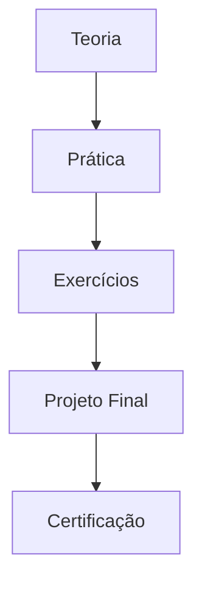
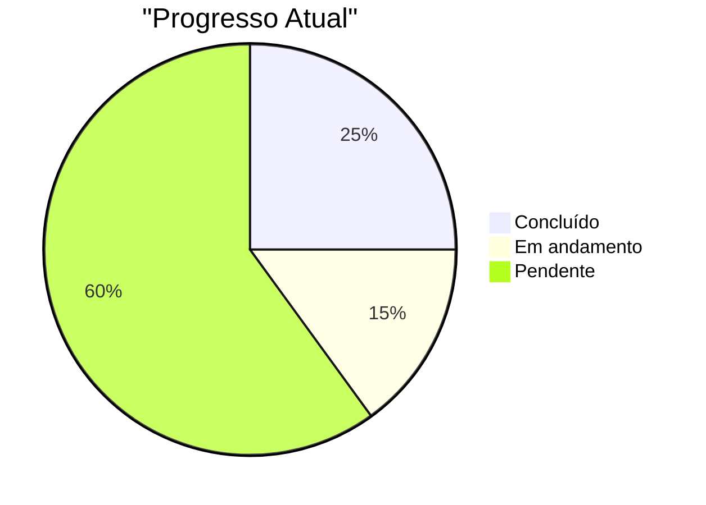

# 📚 Seções de Exemplo

Demonstrações dos recursos do curtoLab

---
layout: two-cols
---

# 🎯 Objetivos do Curso

<v-clicks>

## O que você vai aprender:
- Conceitos fundamentais da tecnologia
- Implementação prática com exemplos
- Melhores práticas da indústria
- Exercícios hands-on guiados

## Pré-requisitos:
- Conhecimento básico de programação
- Ambiente de desenvolvimento configurado
- Motivação para aprender! 🚀

</v-clicks>

::right::

<div v-click="5" class="mt-8">



<div class="text-center mt-4 text-sm opacity-75">
Jornada de Aprendizado
</div>

</div>

<!--
Slide de objetivos - sempre importante deixar claro o que o aluno vai conseguir fazer após o curso.
-->

---
layout: default
---

# 💡 Conceito Fundamental

<div class="grid grid-cols-2 gap-8 mt-8">

<div>

## Definição
Um **conceito importante** é uma ideia central que permeia toda a tecnologia e deve ser compreendida antes de avançar para implementações práticas.

## Características
- **Simplicidade** - Fácil de entender
- **Flexibilidade** - Adaptável a diferentes contextos  
- **Escalabilidade** - Funciona em pequena e grande escala
- **Eficiência** - Otimizado para performance

</div>

<div>

## Exemplo Prático

```python
# Implementação básica do conceito
class ConceptExample:
    def __init__(self, data):
        self.data = data
    
    def process(self):
        """Processa os dados usando o conceito"""
        result = []
        for item in self.data:
            # Aplicar lógica do conceito
            processed = self.apply_concept(item)
            result.append(processed)
        return result
    
    def apply_concept(self, item):
        # Implementação específica
        return item.upper()
```

</div>

</div>

<!--
Exemplo de slide conceitual com código. 
Sempre combine teoria com prática para melhor fixação.
-->

---
layout: center
class: text-center
---

# 🛠️ Demonstração Prática

<div class="text-2xl text-blue-600 mb-8">
Vamos ver isso na prática!
</div>

<div class="space-y-4">
  <div class="text-lg opacity-80">
    Abra seu terminal e siga os passos:
  </div>
  
  <div class="bg-gray-100 dark:bg-gray-800 p-4 rounded-lg">
    <code class="text-sm">
      # Comando de exemplo<br>
      $ python exemplo.py --verbose
    </code>
  </div>
</div>

<!--
Use este layout para transições entre teoria e prática.
Cria expectativa para a demonstração que virá a seguir.
-->

---
layout: default
---

# 🧪 Exercício Hands-on

<div class="grid grid-cols-2 gap-8">

<div>

## 📋 Instruções

<v-clicks>

1. **Abra seu editor** de código favorito
2. **Crie um novo arquivo** `exercicio1.py`
3. **Implemente** a função solicitada
4. **Teste** com os dados de exemplo
5. **Compare** com a solução proposta

</v-clicks>

<div v-click="6" class="mt-6 p-4 bg-blue-50 dark:bg-blue-900 rounded">
<strong>💡 Dica:</strong> Comece simples e vá refinando a solução!
</div>

</div>

<div>

## 🎯 Objetivo

Implementar uma função que:

```python
def processar_dados(lista_items):
    """
    Processa uma lista de items aplicando
    as regras aprendidas no conceito anterior.
    
    Args:
        lista_items: Lista de strings
        
    Returns:
        Lista processada conforme regras
    """
    # Sua implementação aqui
    pass

# Teste com:
dados = ["item1", "item2", "item3"]
resultado = processar_dados(dados)
print(resultado)
```

</div>

</div>

<!--
Exercícios práticos são fundamentais. 
Sempre forneça instruções claras e objetivos específicos.
-->

---
layout: center
---

# 🤔 Quiz Rápido

<div class="mt-8">

<Poll 
  question="Qual das seguintes é uma característica fundamental do conceito apresentado?"
  :answers="[
    'Complexidade máxima',
    'Flexibilidade e adaptabilidade', 
    'Uso exclusivo em projetos grandes',
    'Dependência de frameworks específicos'
  ]"
/>

</div>

<!--
Use polls para verificar compreensão e manter engajamento.
Ideal após seções conceituais importantes.
-->

---
layout: two-cols
---

# ✅ Resumo da Seção

<v-clicks>

## ✨ O que aprendemos:
- Definição e importância do conceito
- Características principais
- Implementação prática básica
- Aplicação em exercício real

## 🚀 Próximos passos:
- Conceitos avançados
- Integração com outras tecnologias
- Projeto prático completo
- Otimizações de performance

</v-clicks>

::right::

<div v-click="6" class="mt-4">

## 📊 Progresso do Curso



<div class="text-center mt-4">
<span class="px-3 py-1 bg-green-100 text-green-800 rounded-full text-sm">
25% Completo
</span>
</div>

</div>

<!--
Slide de resumo/checkpoint importante para fixação e orientação.
Mostra progresso e prepara para próxima seção.
-->
